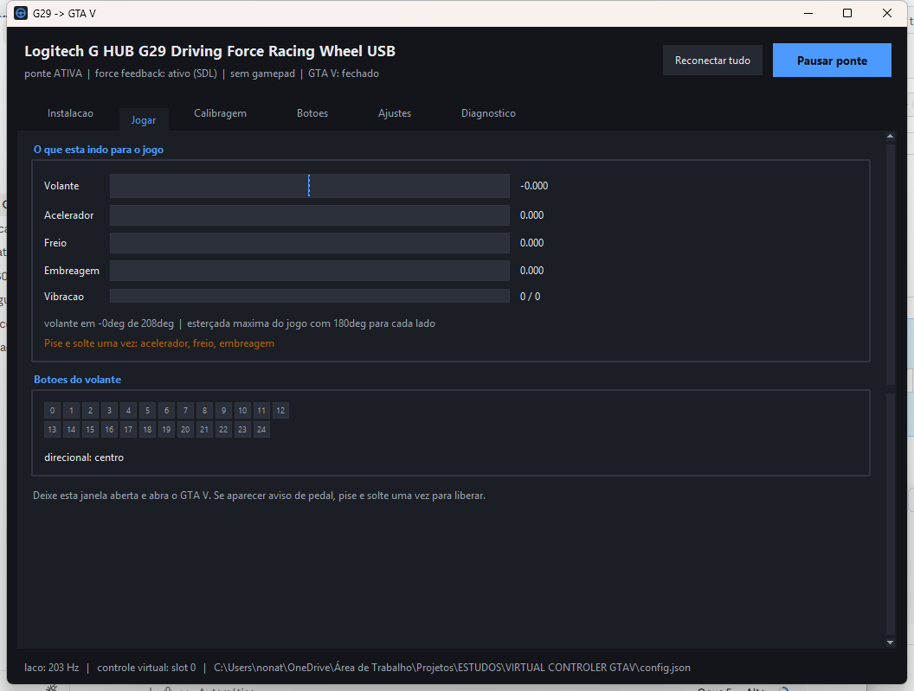

# Logitech Virtual Controller — Volante no GTA V

Faz um volante **Logitech** (G29, G27, G920, G923...) funcionar bem no
**Grand Theft Auto V** — Legacy e Enhanced — com pedais analógicos de verdade,
force feedback e suporte a gamepad junto. Sem mod pago, sem tocar em nenhum
arquivo do jogo.



**Como funciona em uma frase:** o GTA V tem suporte nativo a volante bem ruim,
mas suporte a XInput excelente — então a aplicação lê o volante e cria um
controle de Xbox virtual, que o jogo enxerga como um gamepad comum.

## Baixar

**[⬇ Baixar a versão 1.0.0 (.zip)](https://github.com/GuiRios/Logitech-Virtual-Controller-Steering-Wheel-for-GTA-V/raw/main/VIRTUAL%20CONTROLER%20GTAV%20v1.0.0.zip)**

Descompacte em qualquer pasta e dê um duplo clique em **`DASHBOARD-GTAV.bat`**.
A aba *Instalação* cuida do resto: instala as dependências, o driver do controle
virtual e guia a calibragem.

A única coisa que precisa estar no computador antes é o
[Python 3.9+ 64 bits](https://www.python.org/downloads/) — marque
*Add Python to PATH* na primeira tela do instalador. Se faltar, o próprio
atalho avisa e oferece abrir a página.

## Como funciona

O GTA V tem um suporte a volante nativo bem ruim, mas um suporte a **XInput**
(controle de Xbox) excelente. Então o script:

1. lê o G29 por DirectInput/SDL — volante, 3 pedais, 25 botões e o direcional;
2. cria um **controle Xbox 360 virtual** pelo driver ViGEmBus;
3. reproduz nele os comandos, a 250 Hz:
   - volante → analógico esquerdo (eixo X, com curva e trava suave configuráveis)
   - acelerador → gatilho direito (RT), analógico de verdade
   - freio → gatilho esquerdo (LT), analógico de verdade
   - embreagem → freio de mão (ou o que você quiser)
   - botões e direcional → botões do controle
4. captura a **vibração** que o jogo manda para o controle e converte em
   force feedback no volante (opcional, veja abaixo).

O jogo enxerga só um gamepad comum. Nada é injetado no processo do GTA V,
nenhum arquivo do jogo é alterado.

## Requisitos

| Item | Como obter |
|---|---|
| Windows 10 ou 11 | — |
| Python 3.9+ **64 bits** | [python.org](https://www.python.org/downloads/) — marque *Add Python to PATH* |
| Logitech G HUB (ou LGS) | site da Logitech; o volante precisa estar reconhecido |
| pygame e vgamepad | instalados pela própria aplicação, na aba **Instalação** |
| Driver ViGEmBus | instalado junto com o vgamepad (pede confirmação do Windows) |

Nada de SDK, DLL avulsa ou mod. O force feedback usa o SDL que já vem dentro do
pygame.

### Primeira vez num computador

Um atalho só: **`DASHBOARD-GTAV.bat`**. A própria janela cuida do resto, na aba
**Instalação**:

1. **Instalar dependências** — a aba mostra o que falta (pygame, vgamepad,
   driver ViGEmBus, volante, calibragem) e instala com um clique, com a saída
   aparecendo ali mesmo. A janela abre **mesmo sem as bibliotecas**: ela só
   importa pygame e vgamepad na hora de usá-los, então consegue instalar as
   próprias dependências.
2. **Calibrar** — botão que leva à aba Calibragem, seis passos guiados.
3. **Jogar** — a ponte já liga sozinha; deixe a janela aberta e só então abra
   o GTA V.

A única coisa que a aplicação não resolve sozinha é a falta do **Python** —
ela mesma é um programa Python. Nesse caso o `.bat` explica onde baixar e
oferece abrir a página.

### Compartilhar com outra pessoa

```bash
python empacotar.py
```

Gera um `.zip` com sete arquivos e **um** atalho. Ficam de fora, de propósito, o
`config.json` (sua calibragem e seus ajustes — numa máquina nova eles fariam a
aplicação dizer "calibragem gravada" sem nunca ter calibrado) e o `estado.json`
(memória de slot XInput deste computador).

## A janela

Seis abas, tudo ao vivo:

| Aba | Para quê |
|---|---|
| **Instalação** | checklist do que falta na máquina, instala bibliotecas e driver com um clique, e leva aos passos seguintes |
| **Jogar** | barras ao vivo de volante, acelerador, freio, embreagem e vibração, os 25 botões acendendo, e o ângulo em graus |
| **Calibragem** | eixos crus ao vivo + os 6 passos em botões, sem digitar nada |
| **Botões** | tabela ação → botão; selecione a ação, clique em *Aprender* e aperte o botão no volante |
| **Ajustes** | trava suave, linearidade, zonas mortas, gamepad e força do FFB — **valem na hora**, com o jogo aberto |
| **Diagnóstico** | confere a cadeia inteira, incluindo se os valores chegam certos no XInput |

No topo, dois comandos: **Reconectar tudo** (refaz as ligações) e **Pausar ponte**
(congela a saída sem desconectar). Uma faixa âmbar aparece quando algo precisa da
sua atenção — falta calibrar, ponte pausada, ou o jogo foi aberto antes da ponte.

O jeito prático de acertar a direção: entre num carro no GTA V, alt-tab para a
aba **Ajustes** e vá mexendo a *trava suave* enquanto dirige.

## Linha de comando (para quem preferir)

A mesma engine roda sem interface. Comandos: `--calibrar`, `--calibrar-botoes`,
`--monitorar`, `--testar-pad`, `--testar-ffb`, ou sem argumentos para rodar a
ponte no terminal. O mais útil:

```bash
python g29_gtav.py --testar
```

Checa a cadeia inteira e diz o que falta: volante detectado, calibragem gravada,
driver ViGEmBus, e — o mais importante — **se os valores chegam certos no
XInput**, que é por onde o GTA V lê o controle. Ele escreve volante 50%,
acelerador 75%, freio 25% e o botão A no pad virtual e confere a leitura de volta.

- `--testar-pad` mexe o controle virtual sozinho por 12 s, para você ver a
  resposta no painel `joy.cpl` do Windows.
- `--testar-ffb` toca cinco efeitos no volante (mola fraca, mola forte,
  amortecedor, pista esburacada, terra) para você calibrar a intensidade.

Detalhe útil se você for depurar: **não dá para conferir esses valores pelo
pygame**. O caminho RawInput do SDL devolve analógico e botões zerados para pads
virtuais (só os gatilhos passam), o que parece bug da ponte e não é — pelo
XInput, que é o que importa, chega tudo.

### Dentro do GTA V

- Configurações → Controles → deixe em **Controle** (gamepad), não em teclado.
- Se o jogo insistir em enxergar o volante como volante e brigar com o controle
  virtual, use o **HidHide** (gratuito, mesmo autor do ViGEmBus) para esconder o
  G29 do GTA V — o jogo passa a ver só o controle virtual. É o cenário mais
  confiável, mas na maioria das vezes nem precisa.
- Se abrir pela Steam, desative o **Steam Input** para o GTA V
  (Propriedades → Controle → *Desativar entrada da Steam*), senão a Steam
  remapeia o pad virtual por cima.

## Ajuste fino (`config.json`)

O que mais muda a sensação de dirigir:

| Chave | O que faz |
|---|---|
| `steering_shaping.soft_lock_deg` | **o mais importante.** Quantos graus do volante correspondem à esterçada máxima no jogo. Com 900 fica lento demais e você perde a curva; comece em **360** ou **450** e ajuste. |
| `steering_shaping.wheel_range_deg` | curso físico real do volante (o que está no G HUB, normalmente 900). |
| `steering_shaping.gamma` | `1.0` = linear. Abaixo de 1 deixa o centro mais sensível; acima de 1 (ex.: `1.4`) deixa o centro mais calmo e a ponta mais agressiva — bom para carros nervosos. |
| `pedal_shaping.deadzone` | zona morta dos pedais, se algum "gruda" fora do zero. |
| `clutch.mode` | `handbrake` (padrão), `none`, ou o nome de um botão (`A`, `B`, `LB`...). |
| `loop_hz` | taxa de atualização. 250 é ótimo; baixe para 125 se der uso alto de CPU. |
| `buttons` | mapa `índice do botão do volante` → botão do Xbox. Use `python g29_gtav.py --monitorar` para descobrir o índice de cada botão. |

Comandos úteis:

```bash
python g29_gtav.py --monitorar
```

```bash
python g29_gtav.py --calibrar
```

## Ângulo de esterço (a sensação de "atraso")

O G29 gira 900°, mas o GTA V não usa nada disso — a esterçada máxima do jogo
acontece muito antes. Se a trava estiver alta, você gira meia volta e o carro
mal reage: é isso que parece atraso.

A conta é direta: **você gira `trava ÷ 2` graus para cada lado** até bater no
batente do jogo.

| Trava | Graus para cada lado | Sensação |
|---|---|---|
| 240 | 120° | arcade, reage no toque |
| 360 | 180° | o mais próximo de um carro comum |
| 450 | 225° | equilibrado |
| 540 | 270° | mais simulador |
| 900 | 450° | curso cru, é o que causa o "atraso" |

Na aba **Ajustes** há botões de atalho para cada uma dessas, e a aba **Jogar**
mostra ao vivo em quantos graus o volante está. Mexa com o jogo aberto: vale na hora.

Vale também acertar o **curso físico no G HUB**. Se você reduzir a rotação do
volante lá para 360°, o aro passa a bater fisicamente no fim do curso junto com
a esterçada máxima do jogo — aí ponha `Curso físico` em 360 também, para as
contas baterem.

## Se o jogo "perder" o volante

O GTA V amarra o controle a um **slot XInput** quando o detecta. Se a ponte for
fechada com o jogo aberto, o controle virtual some daquele slot — e ao reabrir
podia renascer em outro, com o jogo continuando a olhar o endereço antigo. Dava
a impressão de que o volante morreu, quando só tinha mudado de lugar; só
reiniciar o jogo resolvia.

A aplicação **detecta essa situação e avisa**: se o processo do GTA V começou
antes de o controle virtual existir, uma faixa âmbar explica o que houve e o que
fazer, em vez de deixar você adivinhando por que o volante emudeceu.

Três medidas contra isso:

- **A ponte liga sozinha** ao abrir a aplicação (`auto_iniciar` no config), então
  não há o caso de esquecer o botão.
- **O slot fica gravado** em `estado.json` e o controle renasce sempre nele. Se
  o slot estiver ocupado por um resto da execução anterior, a ponte espera até
  3s por ele em vez de pegar outro — e, se ainda assim não conseguir, **não
  sobrescreve a memória**, para a próxima tentativa voltar ao slot certo.
- **Pausar não desconecta.** O botão agora é *Pausar ponte*: o controle
  continua conectado, apenas mandando tudo em repouso. Desconectar era o que
  fazia o jogo perder o dispositivo.

Só existem **dois comandos** no topo, com significados que não se confundem:

- **Reconectar tudo** — reabre o volante, reconecta o controle virtual *no slot
  atual* e reprocura o gamepad. É o botão para quando algo parou de responder.
- **Pausar ponte** — congela a saída sem desconectar nada.

A ordem que sempre funciona continua sendo: **abra esta janela primeiro, depois o
jogo.** Se o jogo já estava aberto, a faixa de aviso aparece e nenhum truque
substitui reiniciá-lo.

## Gamepad + volante ao mesmo tempo

O GTA V escuta **um controle XInput só**. Com o volante e um gamepad ligados,
ele trava num dos dois e ignora o outro — na prática, trava na ponte e o
gamepad fica morto.

A solução é a ponte ler os dois e entregar **um controle só** ao jogo:

| Origem | O que manda |
|---|---|
| **Gamepad** | analógico esquerdo (andar), analógico direito (câmera/mira), todos os botões e gatilhos |
| **Volante** | direção, acelerador, freio, embreagem e os botões do aro |

A disputa pelo analógico esquerdo é resolvida por **quem mexeu por último**:

- girou o volante → o volante manda, e **continua mandando numa curva parada**;
- encostou no analógico → o gamepad manda;
- volante largado perto do centro por mais de 1s → devolve ao gamepad sozinho.

Essa última regra existe por um motivo prático: **volante nenhum descansa
exatamente no zero**. A primeira versão dizia "o volante manda se estiver fora
do centro", e o resíduo de repouso fazia o volante vencer para sempre — o
analógico do gamepad nunca passava.

Gatilhos e pedais somam pelo maior, então qualquer um dos dois acelera. Botões
são a união dos dois.

O gamepad é lido **direto pelo XInput**, a mesma API que o GTA V usa. O caminho
do SDL foi descartado depois de medir dois problemas nesta máquina: a ordem em
que ele lista os controles muda entre execuções (a ponte chegou a abrir o
próprio controle virtual e ler a própria saída), e ele devolvia zero para o
gamepad físico enquanto o XInput entregava os valores reais. O slot do controle
virtual é detectado na criação e excluído da busca.

Como o jogo passa a ver um controle só, **não é preciso HidHide** — o GTA V já
ignora o gamepad físico por conta própria.

Na aba **Ajustes**, seção *Gamepad*: liga/desliga a fusão, escolhe qual controle
usar (botão *Procurar* relista) e ajusta a zona morta dos analógicos. Suba a zona
morta se o personagem andar sozinho — é drift do stick.

## Outros volantes (G27, G920, G923...)

Não há nada específico do G29 no código:

- **os eixos são descobertos na calibragem** — o assistente acha sozinho qual é
  o volante e qual é cada pedal, em qualquer ordem;
- **os botões são aprendidos** um a um, então a quantidade não importa;
- **o force feedback usa efeitos genéricos do SDL** (mola, amortecedor,
  periódico), não comandos proprietários da Logitech. A aba Diagnóstico lista
  quais efeitos o *seu* volante aceita.

A detecção reconhece por nome os modelos Logitech (G25, G27, G29, G920, G923,
Momo, Driving Force) e também Thrustmaster e Fanatec. Se ainda assim ele
escolher o aparelho errado, a aba **Calibragem** tem um seletor de volante no
topo — isso importa principalmente quando há um gamepad ligado junto.

**O que eu testei de fato:** só o G29. Para os outros modelos a expectativa é
boa pelos motivos acima, mas é expectativa, não teste. O que pode variar:

| Modelo | Observação |
|---|---|
| **G27** | DirectInput com FFB, 3 pedais e câmbio H separado. Deve funcionar igual; o câmbio vira botões. |
| **G920 / G923** | São voltados ao Xbox e podem aparecer também como dispositivo **XInput**. Se isso acontecer, o GTA V pode enxergá-los direto, e a fusão com gamepad pode confundi-los com um controle. O seletor de volante e o seletor de gamepad resolvem. |
| **Momo / Driving Force antigos** | Dois pedais só; a calibragem simplesmente pula o que não existe. |

Se você testar em outro modelo, o que interessa é o que a aba Diagnóstico diz —
ela mostra o nome detectado, quais efeitos de FFB existem e se os valores estão
chegando ao XInput.

## Force feedback

Funciona **sem SDK, sem DLL e sem download nenhum**: o SDL2 que já vem dentro do
pygame conversa com o G29 por DirectInput e expõe efeitos de verdade. O
diagnóstico confirma quais o seu volante aceita — no G29 são
`CONSTANT, SINE, SPRING, DAMPER, FRICTION, INERTIA, RAMP, GAIN`, com 128 efeitos
simultâneos.

Três efeitos rodam em laço contínuo e só são reenviados quando um valor muda:

- **mola** (`ffb.spring`) — puxa o volante de volta ao centro, dá peso na curva;
- **amortecedor** (`ffb.damper`) — tira a soltura, deixa o aro encorpado;
- **vibração** (`ffb.rumble_to_road`) — a trepidação que o GTA V manda para o
  controle (batida, meio-fio, terra, derrapagem) vira efeito periódico no aro.

Mais o **ganho geral** (`ffb.gain`), que escala tudo de uma vez.

Os parâmetros são **reenviados uma vez por segundo**, mesmo sem mudança. Isso é
rede de segurança: se o efeito for perdido — por outro programa, por
reenumeração de dispositivo, ou porque a primeira aplicação caiu antes de o
volante estar pronto —, ele volta sozinho na volta seguinte. Antes, um envio
perdido ficava perdido para sempre, porque o valor "já tinha sido aplicado", e
a força só voltava se você desmarcasse e marcasse a caixinha.

Todos ficam na aba **Ajustes**, com botão *Testar efeitos* que toca os cinco em
sequência para você calibrar sem entrar no jogo. Pela linha de comando é
`python g29_gtav.py --testar-ffb`.

> A pasta `sdk/` e o motor `LogitechFFB` ficaram como alternativa herdada. Não
> são mais necessários — o caminho pelo SDL é melhor: não depende de download,
> nem de qual janela está em primeiro plano.

## Limitações

- **Sem câmbio manual.** O GTA V não tem marcha manual, então o câmbio H
  (Driving Force Shifter) não tem o que controlar. Se quiser marcha manual,
  embreagem de verdade e câmbio H, existe o mod **Manual Transmission** do *ikt* —
  **gratuito e de código aberto** (GTA5-Mods / GitHub), que é justamente o que
  costumam revender empacotado. Ele usa ScriptHookV, então é **só Story Mode**.
- Este script não é mod: ele não lê nem escreve na memória do jogo, é só um
  remapeador de entrada, como um DS4Windows. Ainda assim, no **GTA Online**,
  a regra prática de sempre vale — qualquer software de terceiros é por sua
  conta e risco, e ScriptHookV/mods **nunca** devem ser usados online.
- Sem telemetria do jogo (velocidade, RPM, força lateral), o force feedback é
  baseado em mola + amortecedor + vibração, não em física do carro. Dá peso e
  informação de pista, mas não é o FFB de um simulador.

## Estrutura

```
DASHBOARD-GTAV.bat   o único atalho: abre a aplicação
g29_gui.py           interface gráfica (usa o g29_gtav como motor)
g29_gtav.py          motor + linha de comando
icone.ico            ícone da janela
criar-icone.py       redesenha o ícone (só se quiser mudar a cor)
checar-volante.py    lê o volante pelo Windows, sem abrir nada em exclusivo
empacotar.py         monta um .zip limpo para compartilhar
requirements.txt
config.json          gerado na primeira execução / pela calibragem
estado.json          memória do slot XInput desta máquina
```

`config.json` e `estado.json` são pessoais de cada computador e não vão para o
repositório.

A interface não duplica lógica nenhuma: ela importa `Wheel`, `VirtualPad`,
`SdlFFB`, `Gamepad` e as funções de mapeamento do `g29_gtav.py`. Corrigir algo
no motor conserta os dois caminhos.

## Licença

**GNU General Public License v3.0** — veja [LICENSE](LICENSE).

Copyright (C) 2026 Gui Rios

O que isso significa na prática:

- **Pode usar, estudar, modificar e redistribuir** à vontade, inclusive
  comercialmente;
- **quem distribuir uma versão modificada é obrigado a publicar o código-fonte**
  dela sob esta mesma licença;
- a **autoria original precisa ser preservada** — ninguém pode republicar isto
  como se fosse obra própria.

A escolha da GPL é deliberada: este projeto nasceu porque existe gente vendendo
essa funcionalidade como mod fechado. A GPL mantém o trabalho aberto e impede
que alguém o feche de novo.

Não é afiliado à Logitech nem à Rockstar Games. Os nomes são usados apenas para
identificar a compatibilidade.
